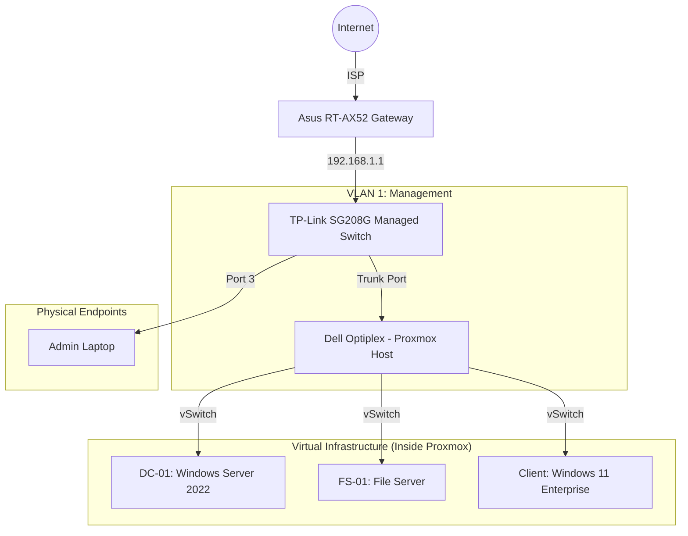

# Leap Industries: Enterprise Infrastructure (Proxmox)

**⚠ STATUS: ACTIVE / IN DEVELOPMENT**

> **Project Migration Note:** This project is the successor to the archived VirtualBox Lab [VirtualBox Lab](../LeapCorp-Enterprise-Lab.md). It runs on dedicated Bare Metal hardware to simulate a realistic branch office environment ("Leap Corporation").

---

## 1. Executive Summary

**Objective:** Migrate "Leap Industries" from a SOHO (Small Office Home Office) setup to an Enterprise-Grade infrastructure using Type 1 Hypervisor virtualization, network segmentation (VLANs), and centralized Identity Management.

**Key Success Criteria:**
* **Virtualization:** Transition from Type-2 (VirtualBox) to Type-1 Hypervisor (Proxmox VE).
* **Network Segmentation:** Implementation of VLANs to separate Management, Servers, and User traffic.
* **Identity:** Centralized Active Directory (AD DS) for user authentication.
* **Security:** Implementation of a "Red Team" VLAN for security testing (Kali Linux) and Incident Response.

---

## 2. Infrastructure & Topology

### Network Diagram

### Hardware Inventory

| Device | Hostname | Role | IP / Configuration |
| :--- | :--- | :--- | :--- |
| Dell Optiplex | HV-01 | Hypervisor (Proxmox VE 8.x) | Static: 192.168.1.10 |
| TP-Link SG208G | SW-CORE-01 | Core Switch (L2 Managed) | Static: 192.168.1.2 |
| Asus RT-AX52 | GATEWAY-01 | Edge Router / Firewall | Gateway: 192.168.1.1 |
| HP Laser Printer | PRN-01 | Network Printer | Static: 192.168.10.50 |

### VLAN Strategy (Traffic Separation)

| VLAN ID | Name | Subnet | Description |
| :--- | :--- | :--- | :--- |
| **1** | Management | 192.168.1.0/24 | Proxmox Console, Switch Mgmt, Router. NO USERS. |
| **10** | Servers | 192.168.10.0/24 | Domain Controllers, File Servers, Print Servers. |
| **20** | Corporate | 192.168.20.0/24 | Employee Laptops, WiFi Clients. |
| **666** | Untrusted | 192.168.66.0/24 | Guest WiFi, IoT, Kali Linux (Red Team). |

---

## 3. Implementation Phases

### Phase 1: The Core Foundation (Flat Network)
**Objective:** Deploy critical infrastructure on the existing network (192.168.50.x) to establish the Active Directory environment immediately.

- **Hardware Assembly:** Connect Core Switch (SG208G) to Edge Router. Connect Dell to SG208G.
- **Virtualization:** Deploy Windows Server 2022 (DC01) and Windows 11 Clients (W11-CLIENT-01 on Proxmox and IT-Admin on a separate machine), 
- **Identity:** Promote DC01 to Domain Controller (leapcorp.local).

### Phase 2: Identity, Policy & Population
**Objective:** Deploy the "Brain" (AD), populate it with users, and enforce corporate policies via Group Policy (GPO).

- **Population:** Bulk create 50 users (Sales, HR, IT) via PowerShell script.
- **Policy Enforcement:** Deploy department-specific Wallpapers and Security settings via GPO.
- **File Services:** Build FS01. Spin up a new Windows Server VM, configure drive maps
- **Client Deployment:** Ensure proper domain joining and permission hierarchy

### Phase 3: Business Services & Operations
**Objective:** Deploy tools that employees actually use.

- **Software Deployment:** Automate application installation (e.g., Chrome, AnyDesk) using GPO or PDQ Deploy.
- **Print Services:** Install Print Server role. Deploy shared printers to specific departments via GPO.
- **Ticketing:** Set up Jira Service Management (Free Cloud). Integrate email alerts.
- **Monitoring:** Deploy Wazuh or Splunk VM. Install agents on DC01 and FS01.

### Phase 4: Network Engineering (The "Big Migration")
**Objective:** Transition from the "Flat Network" to a segmented Enterprise Network using a Virtual Firewall.

- **Virtual Firewall:** Deploy pfSense/OPNsense VM as the new network gateway.
- **Switch Configuration:** Configure TP-Link SG208G with 802.1Q VLANs (10, 20, 666).
- **Migration:** Re-IP servers and clients into their new subnets (Migrate DC01 from 192.168.50.5 to 192.168.10.5).
- **Routing Tables:** Create Firewall rules to block IoT/Guest traffic from accessing the Server VLAN.

### Phase 5: Hybrid Cloud
**Objective:** Extend the on-premise domain to the cloud.

- **Microsoft 365:** Configure Azure AD Connect to sync local users to Entra ID.
- **Intune:** Enroll Windows 11 clients for cloud management.

### Phase 6: Operations & Defense (The "Daily Grind")
**Objective:** Simulate Help Desk tickets and Security Incidents.

**Scenario A (Help Desk):** Intentionally break the Print Spooler. Open Ticket. Diagnose. Fix. Document.
**Scenario B (Security):** Use Kali (VLAN 666) to scan the network (nmap). Check Wazuh for detection.
**Scenario C (Recovery):** Delete a critical file. Restore from Backup (Veeam or Shadow Copy).

---

## 4. Project Journal (The Engineering Log)
A raw log of the process. Real errors, real fixes.

### **DATE - Phase 1: The Core Foundation (Flat Network)

* **Goal:** Deploy critical infrastructure on the existing network (192.168.50.x) to establish the Active Directory environment immediately.
* **Process** 
* **Challenges/Lessons Learned** 
* **Status** 
